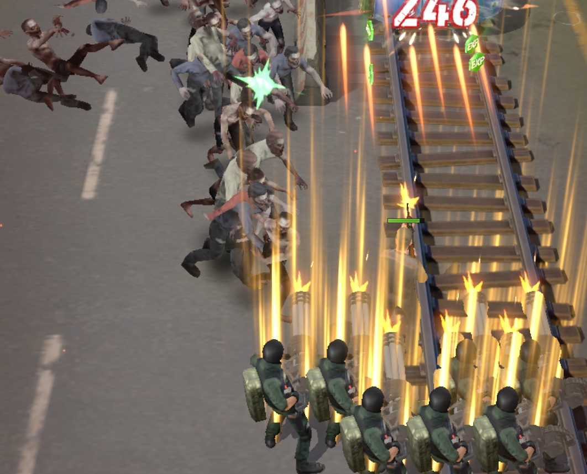
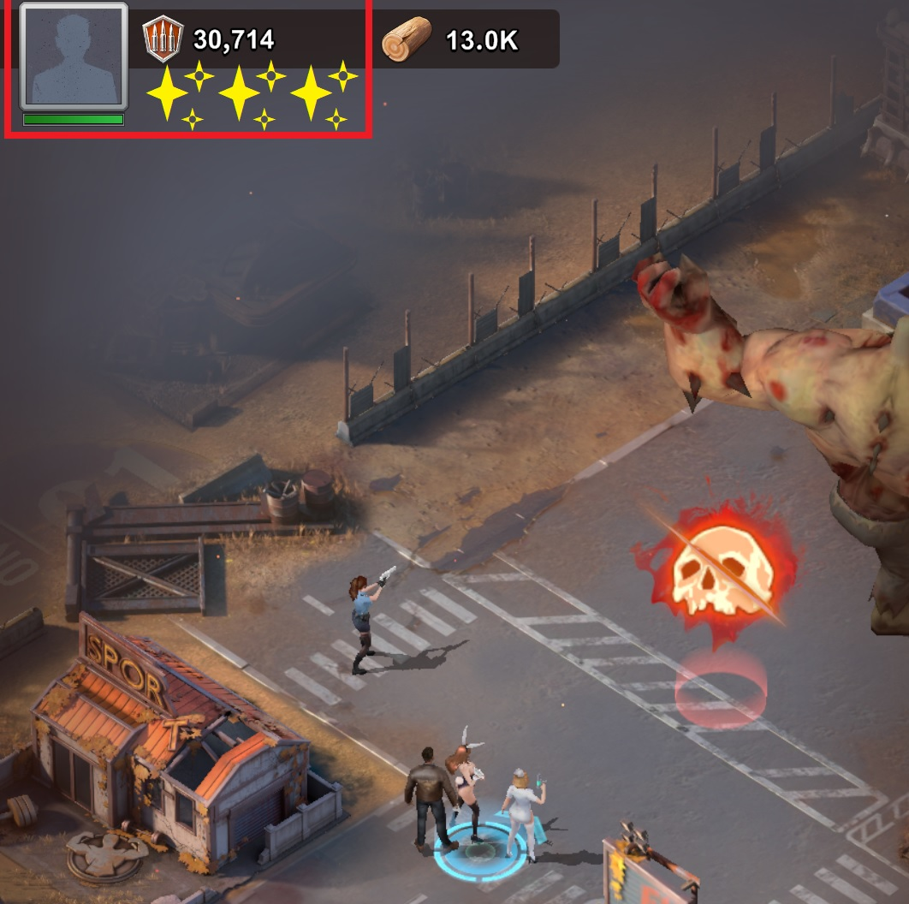
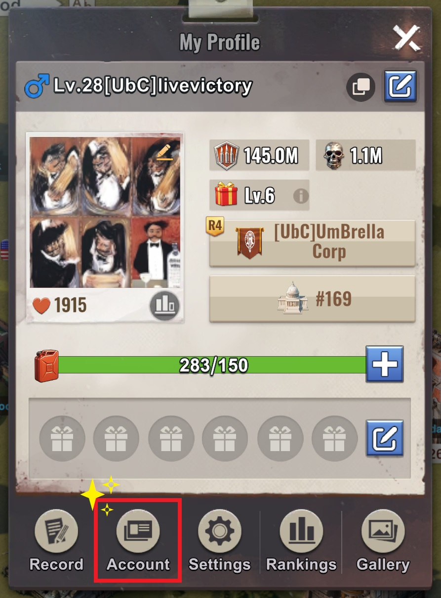
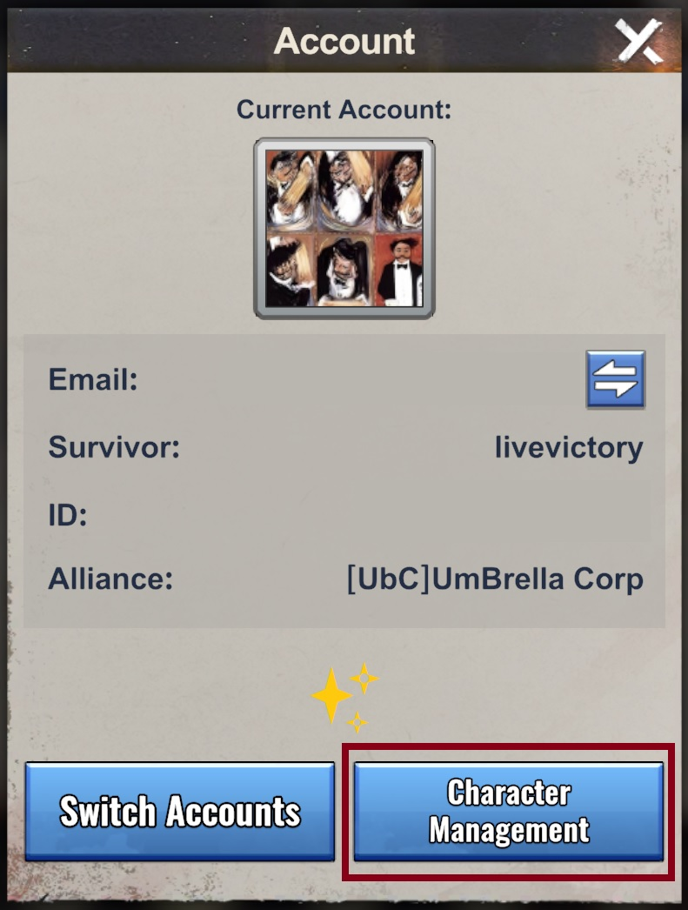

# 🎮 How to create & play 2 accounts on one device

Follow these simple steps to make a new character — no more switching between accounts!

---

## 📱 Step 1: Get a Second Email
You’ll need a **different email address** from the one you use for your main game account.

---

## ⚙️ Step 2: Download a Clone App
Go to the **Google Play Store** and download one of these:
- **Parallel Space**
- **Parallel App** *(worked free and no subscription needed!)*

These apps let you run a second copy of the game on one phone.

---

## 🧟 Step 3: Launch the Game from the Clone App
1. Open the **Parallel App**.
2. Add **Last Z** (the game).
3. Start the game — it will begin from scratch.
4. Play until you reach the part when **your profile appears**.

  
   

---

## 👤 Step 4: Access Your Profile & 🔐 Bind the Account
Once the shelter option appears:
1. Tap **Profile (top-left corner) → Account → Bind**.
2. Bind the game to your **second email address**.
3. A **verification code** will be sent to your email.
4. Open your email, copy the code, and return to the game.
5. Enter the code to finish binding.  
   ✅ Once done, the account is now linked to your new email!

---

## 🧩 Step 6: Create a New Character on Server #169

  
   

1. From the same **Account** menu, go to **Character Management**.
2. Tap the **➕ (plus sign)** to create a **new character**.
3. Select **Server #169** from the list.

> ⚠️ Reminder: You can only have **one character per email per server**.

---

🎉 **All done!**  
You’ve now successfully created a new character on **Server #169**.  
See you at the hive! 🧟🔥
